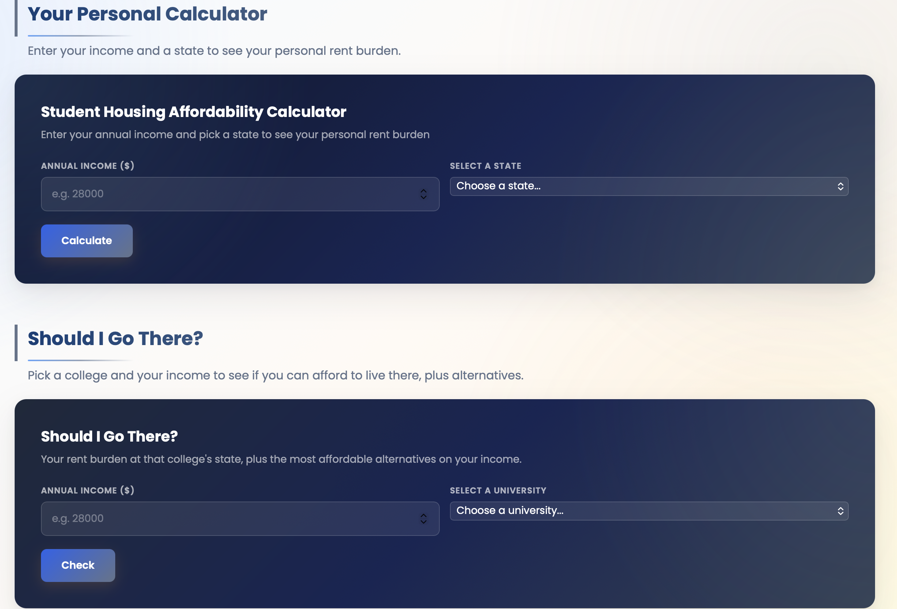
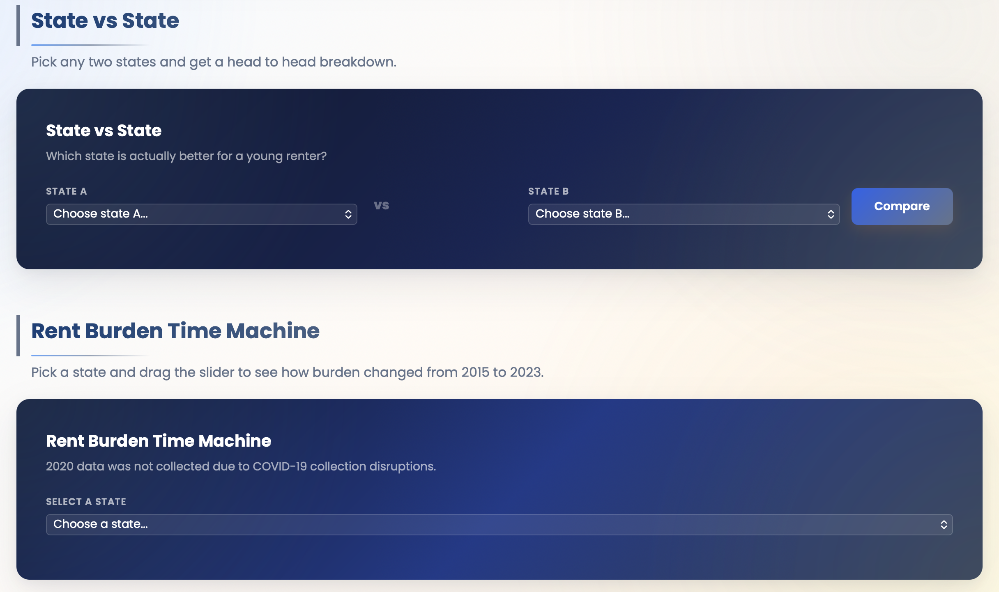

# Rent & Roster: Student Housing Affordability in the U.S.

\> **Can college-age renters actually afford to live in the U.S.?** \>
\> A data-driven investigation into rent burden across all 50 U.S.
states for under-25 householders.

------------------------------------------------------------------------

## What is this repository about?

This repository contains the code, data pipeline, and interactive report
for **Rent & Roster**, a student research project analyzing housing
affordability for college-age renters (ages 18–24) compared to
established adults (ages 25–44).

Using U.S. Census Bureau American Community Survey (ACS) 1-Year
Estimates, we calculate **rent burden ratios**—the percentage of income
spent on rent—across all 51 states (including D.C.) from 2015 to 2023.
The project exposes a stark generational gap: while zero states
cost-burden adults aged 25–44, **34 out of 51 states** cost-burden young
renters.

The final deliverable is a fully interactive **Quarto HTML report**
featuring:

-   **Interactive Leaflet map** of university rent burdens
-   **Exploratory Data Analysis** (histograms, scatter plots, ranked bar
    charts)
-   **Generational gap analysis** comparing under-25 vs. 25–44 age
    groups
-   **Personal Rent Burden Calculator** — enter your income and state
-   **"Should I Go There?" Tool** — check affordability at 80+
    universities
-   **State vs. State Comparator** — head-to-head burden breakdown
-   **Rent Burden Time Machine** — track burden trends from 2015–2023
-   **Horizontal scroll story** — key findings presented as swipeable
    data stories

**Below are some images that show the tools that have been developed
from this project**

-   [*Interactive Leaflet Map*]{.underline}

    

-   [*Student Housing Affordability Calculator & College Burden
    Calculator*]{.underline}

    

-   [*State Comparison & Rent Burden Time Machine*]{.underline}

    

------------------------------------------------------------------------

## Software Requirements

To run the code in this repository, you will need the following
installed on your machine:

| Software | Minimum Version | Notes |
|----|----|----|
| **R** | 4.3.0+ | [Download from CRAN](https://cran.r-project.org/) |
| **RStudio** | 2024.04.0+ | [Download from Posit](https://posit.co/download/rstudio-desktop/) |
| **Quarto** | 1.4.0+ | Bundled with recent RStudio; verify with `quarto --version` |
| **Census API Key** | — | Free key required from [api.census.gov/data/key_signup.html](https://api.census.gov/data/key_signup.html) |

### Required R Packages

The following R packages are used in the analysis. Install them via the
R console before rendering:

``` r
install.packages(c(
  "tidycensus",  # Census data access
  "dplyr",       # Data manipulation
  "tidyr",       # Data reshaping
  "purrr",       # Functional programming
  "ggplot2",     # Static visualization
  "plotly",      # Interactive visualization
  "leaflet",     # Interactive maps
  "tigris",      # TIGER/Line shapefiles
  "sf",          # Simple features / spatial data
  "scales",      # Scale formatting
  "forcats",     # Factor manipulation
  "htmltools",   # HTML generation
  "ggrepel",     # Non-overlapping text labels
  "jsonlite",    # JSON serialization
  "tidyverse"    # Meta-package (used in EDA)
))
```

## How to Run This Project

1.  **Clone the repository**

``` bash
   git clone https://github.com/mac-stat212-s26/project-elma-jack-thusa.git
   cd project-elma-jack-thusa
```

2.  **Restore R packages with renv**

``` r
   renv::restore()
```

3.  **Set your Census API key**

``` r
   tidycensus::census_api_key("YOUR_KEY_HERE", install = TRUE)
```

4.  **Render the project**

``` bash
   quarto render
```

5.  **View the site** — open `docs/index.html` in your browser, or visit
    the live site at `mac-stat212-s26.github.io/project-elma-jack-thusa`

## Data Sources & References

All data used in this project comes from publicly available U.S.
government sources:

| Dataset | Source | Table / Identifier | Years |
|----|----|----|----|
| **Income by Age** | U.S. Census Bureau ACS 1-Year Estimates | Table B19049 | 2015–2023 (excl. 2020) |
| **Median Gross Rent** | U.S. Census Bureau ACS 1-Year Estimates | Table B25064 | 2015–2023 (excl. 2020) |
| **Historical Income** | U.S. Census Bureau Current Population Survey (CPS) | Historical Income Table H-8 | 1984–2024 |
| **Geographic Boundaries** | U.S. Census Bureau TIGER/Line | State shapefiles | 2022 |

-   Data were accessed via the **`tidycensus`** R package (Walker &
    Herman, 2024).
-   Puerto Rico is excluded from the state-level analysis.
-   2020 ACS 1-Year Estimates were not released due to COVID-19 data
    collection disruptions.

> Walker, K., & Herman, E. (2024). *tidycensus: Load US Census Boundary
> and Attribute Data as 'tidyverse' and 'sf'-Ready Data Frames*. R
> package version 1.6.7. https://walker-data.com/tidycensus/

**Authors:** Elma M. (EDA Lead), Jack D. (Income Analysis), Providence
T. (Trend Analysis)\
**Course:** COMP/STAT 212 — Intermediate Data Science, Macalester
College\
**Semester:** Spring 2026
